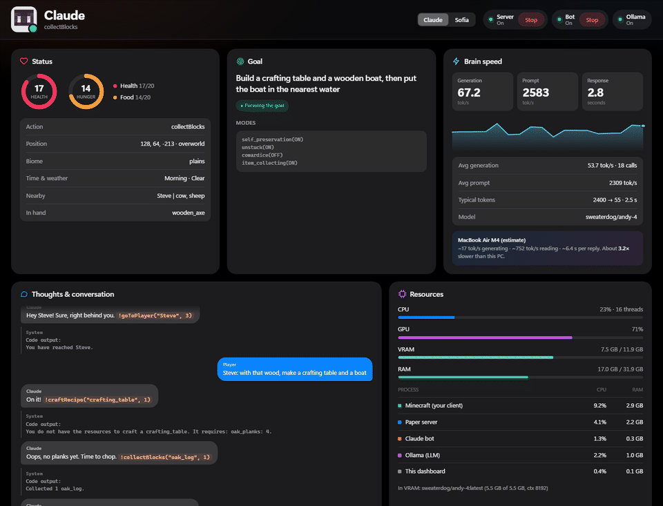
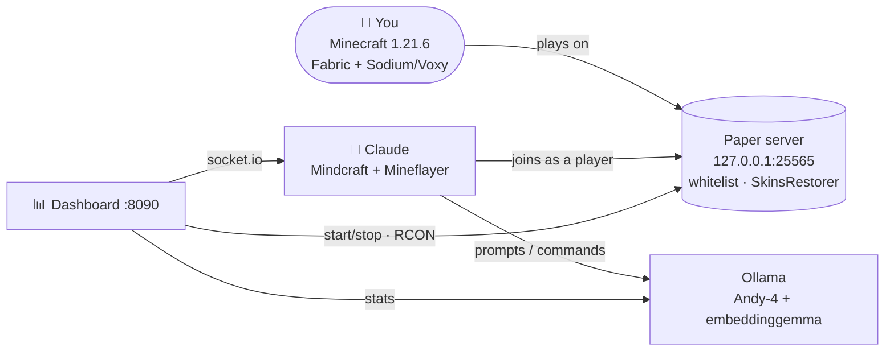

<div align="center">

# FelixIAMinecraft



[](https://github.com/Muurrcc/FelixIAMinecraft/actions/workflows/ci.yml)
[](#requirements)
[](#how-it-works)
[](https://ollama.com/sweaterdog/andy-4)
[](https://nodejs.org)
[](LICENSE)

**A local AI companion that plays Minecraft with you, fully offline on your own PC.**

</div>

Claude joins your world as a real player. It chats, follows you, mines, crafts, builds and sets its own small goals. A local LLM ([Andy-4](https://ollama.com/sweaterdog/andy-4)) runs it, so there are no API keys, no cloud and no subscription. One PowerShell command downloads everything into the project folder, and a live dashboard at `http://127.0.0.1:8090` shows what the bot sees, thinks and plans, and how hard your PC is working.

## Table of contents

- [Features](#features)
- [Requirements](#requirements)
- [Install](#install)
- [Usage](#usage)
- [The dashboard](#the-dashboard)
- [How it works](#how-it-works)
- [Configuration](#configuration)
- [Project layout](#project-layout)
- [Scripts](#scripts)
- [Troubleshooting](#troubleshooting)
- [Uninstall](#uninstall)
- [Roadmap](#roadmap)
- [Contributing](#contributing)
- [Credits](#credits)
- [License](#license)

## Features

- 🧠 **Runs 100% locally.** Andy-4, a model fine-tuned to play Minecraft, runs through a portable [Ollama](https://ollama.com). You need no internet after installing.
- 🎮 **A real player, not a mod.** The bot joins over the network with [Mindcraft](https://github.com/mindcraft-bots/mindcraft) and [Mineflayer](https://github.com/PrismarineJS/mineflayer), so it works in plain survival.
- 💬 **Talk to it in chat.** Ask it to follow you, gather wood, craft a boat or build a house. It also gets curious and sets its own goals when idle.
- 📊 **Apple-style live dashboard.** Health, hunger, current goal, a live chat-bubble view of its thoughts, tokens/s, and CPU/GPU/VRAM/RAM per process. It also has one-click start and stop.
- 🕹️ **Quick commands.** *Follow me*, *Come here*, *Collect wood* and *Stop* buttons run instantly, without waiting for the LLM.
- 👥 **Several bots at once.** Up to 4 companions, each with its own name and personality (explorer, builder, quiet, funny). Switch between them in the dashboard.
- 🔁 **Keeps itself running.** If the bot crashes or gets stuck outside the world, the dashboard restarts it and counts the restarts. World backups can run on a schedule while you play.
- 🧪 **Model picker with real speeds.** Lists the models you have installed with their measured tokens/s, and switches with one click.
- 🌐 **Other servers too.** Point the bots at another Java server (offline mode, or a Microsoft account for the bot). Realms isn't supported.
- 📦 **Fully portable, one-command install.** Node.js, Java 21, Ollama, Paper, plugins and mods all download into the project folder and are checked against SHA-256/512 hashes. Nothing touches your PATH, registry or `.minecraft`.
- 🛡️ **Safe by default.** The server listens only on `127.0.0.1` behind a whitelist. RCON passwords are random per install. The bot can't attack players and can't run arbitrary code. The dashboard rejects requests from other websites.
- ⚡ **Tuned client.** A ready-made [Prism Launcher](https://prismlauncher.org) instance comes with Sodium, Lithium, FerriteCore, ImmediatelyFast, EntityCulling and Voxy for far render distance.
- 🎨 **Custom skin** for the bot through SkinsRestorer, applied automatically on install.

## Requirements

| | Minimum | Tested with |
|---|---|---|
| OS | Windows 10/11 x64 (PowerShell 5.1+, built in) | Windows 11 |
| GPU | 8 GB VRAM (NVIDIA works out of the box; AMD with `-Rocm`) | 12 GB NVIDIA |
| RAM | 16 GB | 32 GB |
| Disk | ~15 GB free | |
| Minecraft | Java Edition **1.21.6** ([Prism Launcher](https://prismlauncher.org) recommended) | |
| Tools | [Git](https://git-scm.com) to clone (or download the ZIP from GitHub) | |

> [!NOTE]
> The model takes about 5.5 GB of VRAM and the Minecraft client needs the rest, so 8 GB is tight and 12 GB is comfortable. Without a GPU it still runs on the CPU, but replies take tens of seconds.

## Install

The installer first checks your Windows version, RAM, VRAM, free disk and ports, and stops if something is clearly missing (`-SkipChecks` skips this).

```powershell
git clone https://github.com/Muurrcc/FelixIAMinecraft.git
cd FelixIAMinecraft

# Downloads everything into this folder (about 7 GB, 10-20 min)
powershell -ExecutionPolicy Bypass -File scripts\install.ps1 -Player YourMinecraftName -DeployPrism
```

`-Player` must be your exact Minecraft username, because it goes on the server whitelist.

<details>
<summary><b>Installer options</b></summary>

| Flag | What it does |
|---|---|
| `-Player <name>` | **Required.** Your Minecraft username. It goes on the server whitelist. |
| `-AcceptEula` | Accepts the [Minecraft EULA](https://aka.ms/MinecraftEULA) without the prompt. |
| `-DeployPrism` | Copies the tuned client instance into Prism Launcher's instances folder. |
| `-Rocm` | Adds Ollama's ROCm libraries for AMD GPUs. |
| `-SkipModels` | Skips downloading the ~5 GB of Ollama models. |
| `-SkipSkin` | Skips the first server boot that gives the bot its skin. |
| `-SkipChecks` | Skips the hardware and port check at the start. |
| `-WithTestServer` | Also sets up a flat test world on port 25566 and the scripted tester bot. |

</details>

### Updating

Run `git pull`, then run the installer again with the same flags. It skips whatever is already in place and never overwrites your `server.properties` or whitelist.

## Usage

The easiest way is to double-click **`FelixIAMinecraft.bat`** in the project folder. It opens a small menu to start or stop everything, open the dashboard, see the status, back up the world or run the installer (it offers the installer on the first run).

Or from PowerShell, start Ollama, the server, the bot and the dashboard:

```powershell
powershell -ExecutionPolicy Bypass -File scripts\start_all.ps1
```

Open Minecraft 1.21.6 (the **IAMine** instance in Prism), join **`127.0.0.1`**, and talk to Claude in chat:

```text
hi Claude, follow me
can you get 10 oak logs?
craft a boat and meet me at the river
stop
```

To stop everything cleanly (saves the world and frees the VRAM):

```powershell
powershell -ExecutionPolicy Bypass -File scripts\stop_all.ps1
```

## The dashboard

`start_all.ps1` opens it automatically at `http://127.0.0.1:8090`. You can also run `scripts\dashboard.ps1` on its own and start or stop the server and bot from its buttons.

| Card | Shows |
|---|---|
| **Status** | Health and hunger rings, current action, position, biome, time and weather, what's nearby, held item |
| **Goal** | The goal the bot is pursuing and its active behaviour modes |
| **Brain speed** | Generation and prompt tokens/s, response latency, a sparkline of recent LLM calls |
| **Thoughts** | The bot's conversation and reasoning as chat bubbles, quick-command buttons and a box to message it directly |
| **Resources** | CPU, GPU, VRAM and RAM, split by Minecraft, server, bot, Ollama and the panel itself |
| **Memory · Inventory · Log** | Long-term memory, inventory, recent reflexes, server log |
| **Bots** | Add or remove bots, pick each one's personality, turn auto-restart on or off, see how many times it restarted |
| **Model** | Installed models with their size and measured tokens/s, a **Measure** button and one-click switching |
| **World & connection** | Play on this PC or on another server, the Microsoft sign-in code when a bot needs one, scheduled and manual backups |

With more than one bot, a selector appears in the header and every card shows the selected bot. Changing bots, personality, model or server restarts the bot so the change applies.

The dashboard follows Apple's Human Interface ideas on the web: a translucent sticky header, press feedback, and animations that only use transform and opacity. It respects `prefers-reduced-motion`, `prefers-reduced-transparency` and `prefers-contrast`, and it adapts down to phone width. It's a single HTML file with no build step and no dependencies, available in English and Spanish (see [Configuration](#configuration)).

## How it works



1. **Paper** runs a normal survival world bound to localhost in offline mode, with a whitelist for you and the bot.
2. **Mindcraft** connects the bot "Claude" as a player. Every few seconds it sends the chat, the bot's state and its memory to the LLM. The model answers in text plus commands such as `!collectBlocks("oak_log", 4)` or `!craftRecipe("boat", 1)`, and Mindcraft carries them out.
3. **Andy-4** runs in Ollama on your GPU. A small embedding model (on the CPU) helps it pick relevant examples.
4. **The dashboard** reads the bot's full state from Mindcraft's mindserver, the LLM timings from Ollama, and process metrics from Windows, then streams them to the browser over Server-Sent Events.

### Changes to Mindcraft

This repo vendors [Mindcraft](https://github.com/mindcraft-bots/mindcraft) (MIT) in [`mindcraft/`](mindcraft) with a few fixes for this setup:

- **Minecraft 1.21.6 support.** Mineflayer is pinned to 4.33.0 with a patch so the bot can dig with the right tool on 1.21.6 block materials.
- **No more `Invalid move player packet` kicks.** The bot no longer sends `/skin clear` on join, because SkinsRestorer handles its skin.
- **Reliable `goToPlayer`/`followPlayer`.** It waits briefly for the player's entity to appear instead of failing at once.
- **LLM telemetry.** Tokens/s and latency for every Ollama call, shown in the dashboard.
- **Safety.** `!attackPlayer` is disabled, and so is `allow_insecure_coding`, which would let the model write and run code.
- **Several bots.** [`tools/build_profiles.js`](mindcraft/tools/build_profiles.js) turns `config/bots.json` into one profile per bot and whitelists new bots on the local server. `settings.js` reads the bots and the server address from there.
- **Quick commands know the nearest tree.** The state sent to the dashboard includes the closest log type, so *Collect wood* asks for `birch_log` in a birch forest.
- **Microsoft sign-in stays in the project.** Tokens for bots with a Microsoft account are cached in `data/auth/`, not in your `.minecraft`.
- A companion profile template ([`profiles/claude_bot.json`](mindcraft/profiles/claude_bot.json)) with a curious, brief, slightly jokey personality.

## Configuration

| File | Purpose |
|---|---|
| [`config/llm.json`](config/llm.json) | **Where the LLM runs and which model it uses.** It's applied to the bot profile on every start. |
| [`config/language.json`](config/language.json) | **Language of the bot's chat and the dashboard.** Default `"en"`. |
| [`config/bots.json`](config/bots.json) | **Which bots join and where.** Names, personalities, and the server address, port, account type and version. The dashboard edits it for you. |
| [`config/personalities.json`](config/personalities.json) | The personality lines for explorer, builder, quiet and funny. Add your own key to get a new option. |
| [`mindcraft/settings.js`](mindcraft/settings.js) | Bot behaviour: blocked actions, memory and chat settings. |
| [`mindcraft/profiles/claude_bot.json`](mindcraft/profiles/claude_bot.json) | The template every bot profile is built from: prompts and examples. |
| `server/main/server.properties` | Generated from [`server-template/`](server-template) on install: view distance, difficulty and similar settings. |

**Change the language.** Set `"language"` in `config/language.json` to `"es"` for Spanish, then restart the bot and the dashboard. Both use English by default. Any other language name (for example `"French"`) also works for the bot's chat, which is translated with Google Translate, and the dashboard stays in English. The bot's internal prompts are always in English, which keeps Andy-4 reliable.

**Use a different model.** Pick it in the dashboard's **Model** card, or change `chat_model` in `config/llm.json` (for example `ollama/sweaterdog/andy-4:q5_k_m`) and restart the bot. To get a new one, run `runtime\ollama\ollama.exe pull <model>` while Ollama is running.

**Join another server.** In **World & connection** choose *Another server* and enter its address. With *Offline*, the server must have `online-mode=false`. With *Microsoft account*, each bot needs its own Minecraft license, and the first time the dashboard shows a code to enter at microsoft.com/link. Leave the version on `auto` unless the server needs a specific one. Realms isn't supported, because Mineflayer can't join Realms.

**Run the LLM on another machine** (for example a Mac with Apple Silicon running Ollama). Set `"backend": "remote"` and `"url": "http://<that-machine-ip>:11434"` in `config/llm.json`. The dashboard shows an estimate of how an M4 compares with your PC.

## Project layout

```
FelixIAMinecraft/
├── scripts/            install, start/stop/status, backup, Prism deploy, RCON client, LLM benchmark
├── dashboard/          the live web panel (server.mjs + a single index.html)
├── mindcraft/          vendored Mindcraft with the fixes above
├── config/             llm.json, language.json, bots.json, personalities.json
├── server-template/    server.properties / spigot.yml templates (passwords filled in at install)
├── client/IAMine/      Prism Launcher instance template (mods are downloaded by the installer)
├── tests/tester-bot/   scripted bot that checks the companion over chat (no LLM)
└── FelixIAMinecraft.bat  double-click menu: start, stop, dashboard, status, backup, install

# created by the installer or at runtime, never committed:
runtime/  models/  cache/  server/  logs/  run/  backups/  data/
```

## Scripts

All scripts live in `scripts\` and run with `powershell -ExecutionPolicy Bypass -File scripts\<name>.ps1`.

| Script | What it does |
|---|---|
| `install.ps1` | Downloads and sets up everything. See [Install](#install). |
| `start_all.ps1` | Builds the bot profiles, then starts Ollama, Paper (waits for "Done"), the bots and the dashboard. `-ServerOnly` starts only the server. With an external server in `config/bots.json` it skips the local one. |
| `stop_all.ps1` | Stops the server over RCON (the world is saved), then stops the bot and Ollama, and cleans up leftover processes. |
| `status.ps1` | Shows which parts are running, open ports, loaded models and free disk space. |
| `dashboard.ps1` | Starts only the dashboard. |
| `backup.ps1` | Zips the world into `backups/` and keeps the latest 10 (`-Keep <n>` to change). From the dashboard it's safe with the server running, because saving is paused first. |
| `bench_llm.ps1` | Measures tokens/s and latency of the configured model. |
| `run_fase2_tests.ps1` | Runs the scripted tester bot against a fresh flat test world. Needs `-WithTestServer` at install. |

## Troubleshooting

<details>
<summary><b>The script is blocked by execution policy</b></summary>

Run the scripts with `powershell -ExecutionPolicy Bypass -File ...` as shown above. This only affects that one process and doesn't change your system policy.
</details>

<details>
<summary><b>"You are not whitelisted on this server"</b></summary>

Your in-game name must match `-Player`. To add a friend, start the server and run:

```powershell
$ip, $port, $pass = (Get-Content run\rcon_main.txt).Split(':')
runtime\node\node.exe scripts\rcon_client.js $ip $port $pass "whitelist add FriendName"
```
</details>

<details>
<summary><b>The bot answers slowly or the game stutters</b></summary>

Check the **Resources** card on the dashboard. If VRAM is full, the model spills into system RAM and slows down a lot. Close other GPU-heavy apps, lower Voxy's render distance, or use a smaller quantization in `config/llm.json`.
</details>

<details>
<summary><b>VRAM stays in use after stopping</b></summary>

`stop_all.ps1` kills leftover `llama-server.exe` processes started from this folder. Always stop with it rather than closing windows by hand.
</details>

<details>
<summary><b>Minecraft crashes on launch with Voxy or Sodium</b></summary>

Voxy is alpha software and needs matching Sodium and Fabric API versions. Use exactly the versions in [`scripts/downloads.json`](scripts/downloads.json). If it still crashes, delete `voxy-*.jar` from the instance's `mods` folder. Everything else works without it.
</details>

## Uninstall

Run `scripts\stop_all.ps1` and delete the folder. If you used `-DeployPrism`, also delete the **IAMine** instance in Prism Launcher. Nothing else was installed.

## Roadmap

- [x] Portable, hash-verified one-command installer
- [x] Live dashboard with per-process resource usage
- [x] Automatic bot skin
- [x] English dashboard UI and English as the default bot language (Spanish available)
- [x] Several bots at once, with personalities and a bot selector
- [x] Quick commands, auto-restart, scheduled backups and a model picker
- [x] Joining external servers (offline mode or Microsoft account)
- [ ] Linux and macOS scripts
- [ ] Realms (needs Mineflayer support)

## Contributing

Questions, bug reports and ideas are welcome in [Issues](https://github.com/Muurrcc/FelixIAMinecraft/issues). Pull requests are welcome too, and [CONTRIBUTING.md](CONTRIBUTING.md) has the details:

1. Fork the repo and create a branch (`git checkout -b fix/my-change`).
2. Keep changes to `mindcraft/` small and list them under [Changes to Mindcraft](#changes-to-mindcraft), so upstream updates stay easy.
3. If you touch the bot or the server, run `scripts\run_fase2_tests.ps1` (needs `-WithTestServer` at install).
4. Open a pull request that explains what changed and why.

## Credits

- [Mindcraft](https://github.com/mindcraft-bots/mindcraft) (MIT): the LLM agent framework the bot is built on
- [Andy-4](https://ollama.com/sweaterdog/andy-4) by Sweaterdog: the Minecraft-tuned model
- [Mineflayer](https://github.com/PrismarineJS/mineflayer), [Ollama](https://ollama.com), [PaperMC](https://papermc.io), [SkinsRestorer](https://skinsrestorer.net)
- Client mods: [Sodium](https://modrinth.com/mod/sodium), [Lithium](https://modrinth.com/mod/lithium), [FerriteCore](https://modrinth.com/mod/ferrite-core), [ImmediatelyFast](https://modrinth.com/mod/immediatelyfast), [EntityCulling](https://modrinth.com/mod/entityculling), [Dynamic FPS](https://modrinth.com/mod/dynamic-fps), [BadOptimizations](https://modrinth.com/mod/badoptimizations), [Voxy](https://modrinth.com/mod/voxy), [Fabric API](https://modrinth.com/mod/fabric-api)

This project isn't affiliated with Mojang, Microsoft or Anthropic. "Claude" is just the bot's in-game name. Minecraft is a trademark of Mojang Studios.

## License

[MIT](LICENSE) © FelixIAMinecraft contributors. The vendored Mindcraft keeps its own [MIT license](mindcraft/LICENSE). The installer downloads third-party software under its own licenses and doesn't redistribute it.
